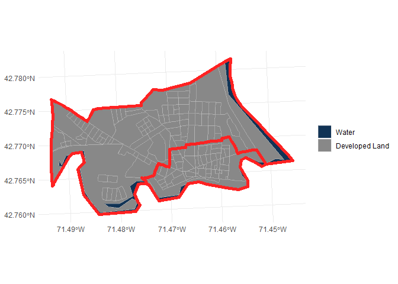

<!-- README.md is generated from README.Rmd. Please edit that file -->

# hercgeos

<!-- badges: start -->
<!-- badges: end -->

The goal of hercgeos is to make it a little easier and more efficient to
work with spatial data from the US Census and related sources.

## Installation

You can install the development version of hercgeos from
[GitHub](https://github.com/) with:

``` r
# install.packages("devtools")
devtools::install_github("higherX4Racine/hercgeos")
```

## Example

The fresh-from-the-servers
[TIGER/Line®](https://www.census.gov/cgi-bin/geo/shapefiles/index.php)
shapefiles have *EXECRABLE* column names. hercgeos helps with this.

``` r
library(hercgeos)
NASHVILLE_NH |>
    purrr::discard_at("historic_district") |>
    purrr::map(names) |>
    tibble::enframe(name = "Layer", value = "Names") |>
    knitr::kable(caption = "Original column names")
```

| Layer  | Names                                                                                                                                                                                         |
|:-------|:----------------------------------------------------------------------------------------------------------------------------------------------------------------------------------------------|
| blocks | STATEFP20 , COUNTYFP20, TRACTCE20 , BLOCKCE20 , GEOID20 , NAME20 , MTFCC20 , UR20 , UACE20 , UATYPE20 , FUNCSTAT20, ALAND20 , AWATER20 , INTPTLAT20, INTPTLON20, HOUSING20 , POP20 , geometry |
| tracts | STATEFP , COUNTYFP, TRACTCE , GEOID , NAME , NAMELSAD, MTFCC , FUNCSTAT, ALAND , AWATER , INTPTLAT, INTPTLON, geometry                                                                        |

Original column names

``` r

NASHVILLE_NH |>
    purrr::discard_at("historic_district") |>
    purrr::map(fix_old_year_suffixes) |>
    purrr::map(names) |>
    tibble::enframe(name = "Layer", value = "Names") |>
    knitr::kable(caption = "Repaired column names")
```

| Layer  | Names                                                                                                                                                       |
|:-------|:------------------------------------------------------------------------------------------------------------------------------------------------------------|
| blocks | STATEFP , COUNTYFP, TRACTCE , BLOCKCE , GEOID , NAME , MTFCC , UR , UACE , UATYPE , FUNCSTAT, ALAND , AWATER , INTPTLAT, INTPTLON, HOUSING , POP , geometry |
| tracts | STATEFP , COUNTYFP, TRACTCE , GEOID , NAME , NAMELSAD, MTFCC , FUNCSTAT, ALAND , AWATER , INTPTLAT, INTPTLON, geometry                                      |

Repaired column names

There are also some nice presets for mapping

``` r
ggplot2::ggplot() +
    geom_terrain(
        NASHVILLE_NH$blocks |>
            fix_old_year_suffixes() |>
            fix_latlong_to_numeric() |>
            transform_tiger_to_utm() |>
            dplyr::mutate(
                Terrain = terrain_factor(.data$UR,
                                         .data$AWATER,
                                         .data$ALAND)
            )
    ) +
    ggplot2::geom_sf(
        data = NASHVILLE_NH$tracts |>
            fix_latlong_to_numeric() |>
            transform_tiger_to_utm(),
        fill = NA,
        color = "#ff2222",
        linewidth = ggplot2::rel(2)
    ) +
    ggplot2::theme_minimal()
```


